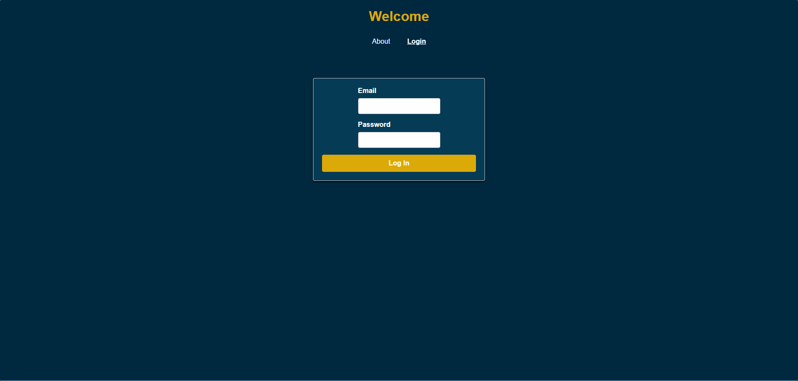
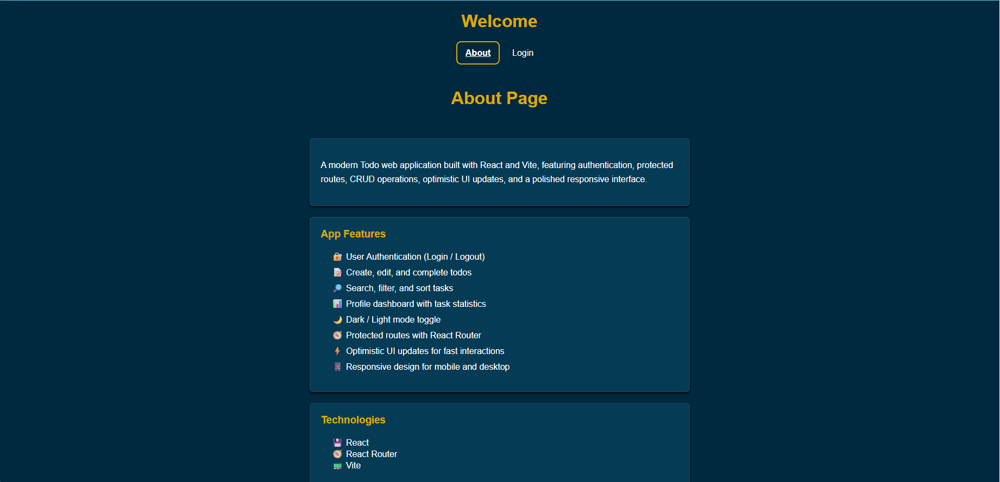
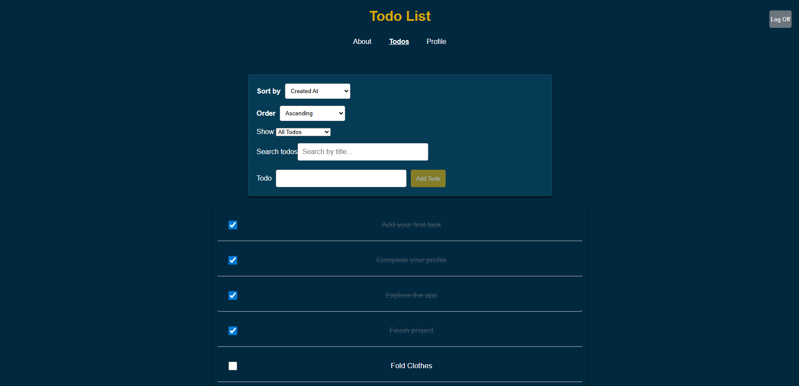
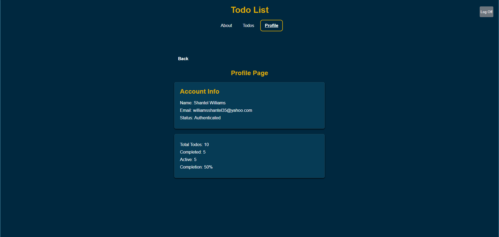
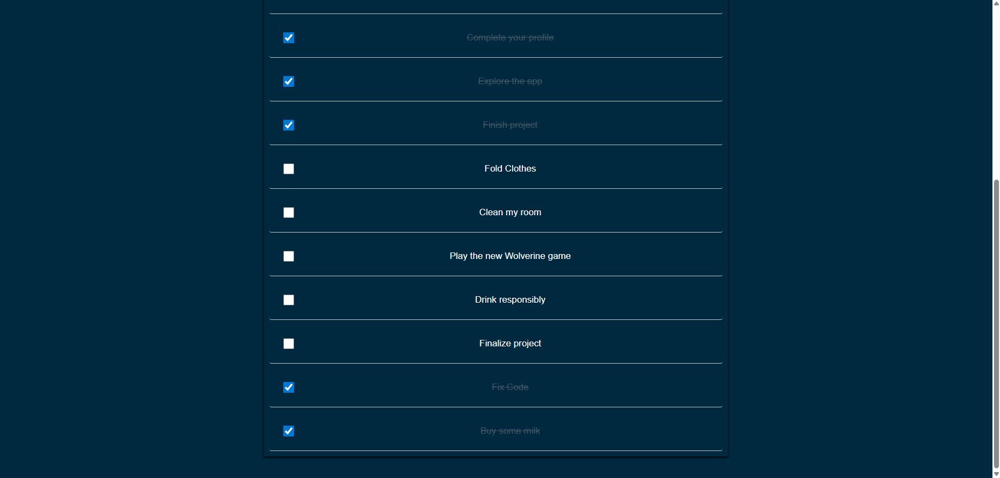

# 📝 React Todo App

A responsive Todo management application that allows users to securely log in, create, edit, complete, search, sort, and filter their tasks while viewing personal Todo statistics.


## ✨ Features

- 🔐 User authentication with login and logout
- 📝 Add, edit, and complete todos
- 🔎 Search todos by title
- 🔃 Sort todos by different options and directions
- 📋 Filter todos by active, completed, or all
- 📊 Profile page with todo statistics
- 🧭 Protected routes using React Router
- ⚡ Optimistic UI updates for faster interactions
- 📱 Responsive design for desktop and mobile
- ⚠️ User-friendly error and loading messages
- 🔒 Client-side validation and input length limits

## 🛠️ Technologies Used

- React
- Vite
- React Router
- JavaScript
- HTML
- CSS
- REST API
- Git & GitHub

## 📸 Screenshots

### Desktop View

Screenshot of the Todo application on a desktop screen.







[Live Demo](https://summer-todo-list-hrihfdymg-shantelwis-projects.vercel.app)

---

## 🚀 Getting Started

### Clone the repository

```bash
git clone https://github.com/Shantelwi/summer_todo_list
```

### Install dependencies

```bash
npm install
```

## 📜 Available Scripts

The following commands are available in the project:

* `npm run dev` — Starts the Vite development server.
* `npm run build` — Builds the application for production.
* `npm run preview` — Previews the production build locally.

Open:

```bash
http://localhost:5173
```

## 🎨 Design Decisions

- **React** was used to build the user interface with reusable components.
- **useReducer** was used to manage Todo state and keep state changes organized.
- **Context API** was used to share authentication information across the application.
- **React Router** was used for page navigation and protected routes.
- **Optimistic updates** make Todo actions feel faster by updating the screen before the API request finishes.
- **Responsive CSS** allows the application to work on both desktop and mobile screens.
- **Client-side validation** helps prevent empty Todo titles and limits the length of user input.

### Styling Approach

The application uses plain CSS with a shared global stylesheet. I chose this approach to keep the styling simple and easy to maintain while learning React.

The styling is applied consistently across the application, including the navigation, forms, Todo list, buttons, error messages, and pages. Responsive CSS and media queries are used to make the application work on both desktop and mobile screen sizes.

## 🔮 Future Improvements

- Add due dates and reminders for Todos.
- Add Todo categories.
- Add pagination for larger Todo lists.
- Add more automated tests.
- Continue improving accessibility and keyboard navigation.

## 📬 Contact

GitHub: [Shantelwi](https://github.com/Shantelwi)

## 📄 License

This project is provided for educational and portfolio purposes. The source code is available for learning and demonstration purposes.
